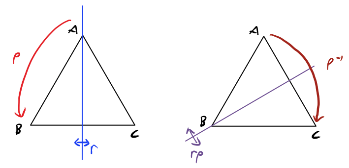
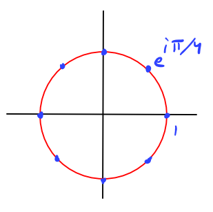

# Groups

$$
\newcommand{\ds}{\displaystyle}
\newcommand{\curlies}[1]{\left\lbrace #1 \right\rbrace}
\newcommand{\abs}[1]{\left\lvert #1 \right\rvert}
\newcommand{\angles}[1]{\left\langle #1 \right\rangle}
\newcommand{\inv}[1]{#1^{-1}}
$$

## Symmetry

What is symmetry? It's actually not immediately obvious.

## Groups

A **group** is a set $G$ with a binary operation $\cdot$ which satisfies:

1. Associative rule: if $x, y, z \in G$, then $(x \cdot y) \cdot z = x \cdot (y \cdot z)$
2. Identity element: there exists $e \in G$ so that if $x \in G$ then $e \cdot x = x = x \cdot e$
   - the identity is sometimes denoted by other symbols, like $I$, or $id$, or $Id$, or $0$, or $1$, depending on the particular group
3. Inverses: for every $x \in G$, there is an element $x^{-1} \in G$ so that $x^{-1} x = e$

### Examples

- $(\Z, +)$, the integers with the addition operation
  - addition is associative
  - the identity, because $0 + x = x = x + 0$
  - the inverse of $x$, since $x + (-x) = 0$
- For any field $F$
  - $(F, +)$ is a group (by definition) with identity $0$
  - If $F^\times = F \setminus \curlies{0}$ is all the nonzero elements of the field, then $(F^\times, \times)$ is a group
- if $M_n(F)$ are the $n \times n$ matrices over $F$
  - this set with matrix multiplication is not a group because not every matrix has an inverse
  - if we define $GL(n, F)$ as all of the $n \times n$ matrices over $F$ with inverses, then $(GL(n, F), \cdot)$ is a group.
- Consider an equilateral triangle, it is preserved under rotation by multiples of $2\pi/3$ and reflections over medians. Together with $e$, the transformation that does nothing, these transformations form a group ($D_3$)
  - 
  - $\rho$ is a rotation by $2\pi/3$ and $r$ is a reflection
  - the way $\rho$ and $r$ transform the triangle are what we can think of as symmetries

### Properties of groups

- $e$ is unique
- inverses are unique, i.e. if $x \in G$, there is only one element $\inv x$
- $\inv{(xy)} = \inv{y} \inv{x}$
  - "if you put on your socks then put on your socks, you have to take them off in the opposite order"
- $x_1 \cdot x_2 \cdot ... \cdot x_k$ is independent of where you put parentheses (generalized associative law)
  - for $k = 3$, this is just the associative law

## Subgroups

If $G$ and $H$ are groups with the same operation and $H \subseteq G$, then $H$ is called a **subgroup** of $G$ and we write $H \leq G$ (or if $H$ is a strict subset i.e. $H \subset G$, then we write $H < G$)

### Examples:

- With addition,

$$
(\Z, +) < (\Q, +) < (\R, +) < (\C, +)
$$

- With multiplication,

$$
(\Q^\times, \times) < (\R^\times, \times) < (\C^\times, \times)
$$

- $\curlies{e, \rho, \rho^2}$ is the rotation subgroup of the triangle group
- the invertible upper-triangular $n \times n$ matrices over $F$ is a subgroup of $GL(n, F)$
- we will write $\Z/n$ to denote the integers mod $n$, [...]

### Generated subgroups

If $x \in G$, the **subgroup of $G$ generated by $x$**, written $\angles x$, is defined as

$$
\angles x = \bigcap_{\alpha} H_\alpha \text{ where each $H_\alpha$ is a subgroup containing $x$}
$$

if $S \subseteq G$, the subgroup of $G$ generated by $S$ is defined as

$$
\angles S = \bigcap_{\alpha} H_\alpha \text{ where each $H_\alpha$ is a subgroup containing $S$}
$$

#### Cyclic groups

A group of the form $G = \angles x$ is called a cyclic group.

e.g. the picture above is of $\angles{e^{i\pi/4}} \leq \C^\times$

Notice that $\Z$ is a cyclic group! We refer to it as *the* infinite cyclic group.

## Order

The **order of a group $G$** is the number of elements of $G$, written as $\abs G$.

- $\abs{D_3} = 6$ (the triangle group)
- $\abs{\Z} = \infty$
- $\abs{\curlies{e, \rho, \rho^2}} = 3$

If $x \in G$, then **the order of $x$** is $\abs x = \abs{\angles x}$.