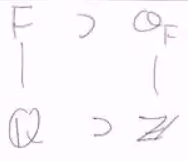

# Rings

$$
\newcommand{\ds}{\displaystyle}
\newcommand{\curlies}[1]{\left\lbrace #1 \right\rbrace}
\newcommand{\abs}[1]{\left\lvert #1 \right\rvert}
\newcommand{\angles}[1]{\left\langle #1 \right\rangle}
\newcommand{\inv}[1]{#1^{-1}}
\newcommand{\divides}{ {\large\mid} }
\newcommand{\ndivides}{ {\large\not\mid} }

\newcommand{\Sp}{\mathbb S}
\newcommand{\F}{\mathbb F}
$$

## Rings

A **ring** is a set $R$ with two operations, $+$ and $\times$, which has the following properties:

- $(R, +)$ is an abelian group
  - we denote the identity of $(R, +)$ as $0$
- $\times$ is associative
- $R$ follows the two distributive laws:
  - $a (b + c) = ab + ac$
  - $(a + b) c = ac + bc$

A ring is **commutative** if $\times$ commutes. (We use the word commutative when we describe multiplication commuting and abelian when we discuss addition commuting.) $R$ is a ring **with unit** or **with identity** if there is an element $1 \in R$ so that $x \times 1 = 1 \times x = x$. Some books define a ring to be a ring with identity, some books have even weirder definitions.

### Examples

Some examples of rings are:

- $\Z$ is a commutative ring with unit

- fields are commutative rings with unit where every element element other than $0$ is invertible

- skew-fields are just like fields, except they are not commutative
  
  - the quaternions (real quaternions) are a skew-field - this is the set of 4-tuples $a + bi + cj + dk$ where $a, b, c, d \in \R$ and $1, i, j, k$ multiply just like they do in the quaternion group
  
- many classes of functions on $\R$ are rings with pointwise addition and multiplication:
  - all functions on $\R$
  - $C^k(\R)$, the set of $k$-times differentiable functions
  - $C^\infty(\R)$, the set of smooth functions
  - $C_C(\R)$, the set of continuous functions on $\R$ with compact support (does not have identity)
    - this is also a ring with the multiplication being convolution
  - the similar classes of functions on other spaces are also rings
  
- if $G$ is a finite group and $F$ is a field, we write $F[G]$ for the **group ring** of $G$: the set of all formal linear combinations $\ds \sum_{g_i \in G} c_i g_i$ where $c_i \in F$, $g_i \in G$

  - we define multiplication by:
    - $\left(\sum_{g_i \in G} c_i g_i\right)\left(\sum_{g_j \in G} d_j g_j\right) = \sum_{g_i \in G} \sum_{g_j \in G} (c_i d_j) (g_i g_j)$ 
  - in this case, $F[G]$ is commutative if and only if $G$ is abelian
  - (this is a generalization of the quaternions)

- polynomials form rings

  - if $F$ is a field, then $F[x] = \curlies{a_0 + a_1 x + ... + a_k x^k : a_i \in F, k \in \N_0}$, the polynomials over $F$, is a ring
  - if $R$ is a ring, the similarly defined $R[x]$ is a ring
  - note that $F \subseteq F[x]$, $R \subseteq R[x]$
  - $F[x_1, ..., x_n]$ is the set of polynomials over $F$ in $n$ variables
    - usually we assume that the variables commute with each other, i.e. $x_i x_j = x_j x_i$
    - we can have non-commuting polynomials too though

- the set of $n \times n$ matrices over a field $F$ or a ring $R$ form a ring

  - this ring is non-commutative unless $n = 1$
  - note that we cannot guarantee invertibility since invertible matrices are not closed under addition

- if $(A, +)$ is any abelian group, then we can create a ring $R$ by giving $A$ "the stupidest multiplication", so that $x \times y = 0$ for all $x, y \in R$

  > "This multiplication is so stupid that it doesn't tell us anything."
  >
  > \- Joe
  >
  > "We can have groups with pretty pathetic multiplications and they can become rings."
  >
  > \- Joe
  
- the Gaussian integers $Z[i] = \curlies{a + bi : a, b \in \Z} \subseteq \C$, are inside the complex numbers analogously to how the normal integers are inside the real numbers

- the set $\curlies{a + b\sqrt 2 : a, b \in Z} \subseteq \R$, the ring of integers of $\Q(\sqrt 2)$, is analogous to the normal integers inside $\R$

- $\Z/n\Z$ is a commutative ring with identity

  - it is also a field if and only if $n$ is prime
    - one reason is because if $n = jk$, then there are nonzero elements $x$ and $y$ where $xy = 0$, which cannot happen in a field
    - elements of a ring that can multiply to $0$ are called $0$-divisors - for example, every element of $C_C(\R)$ is a zero divisor

### Lemma: $0 \cdot r = 0$ in a ring

This lemma is easy to prove if the ring has unit:

$$
0 \cdot r = (1-1)r = 1r - 1r = r-r = 0
$$

In general, we use the fact that $0 + 0 = 0$:

$$
0 \cdot r = (0 + 0) r = 0r + 0r
$$

so $0r = 0r + 0r$, so $0r$ must be equal to $0$.

## Ring homomorphisms

If $R, S$ are rings, a homomorphism $\phi : R \to S$ is a function that is a group homomorphism between the additive groups of $R$ and $S$ which preserves multiplication as well. So $\phi$ is a homomorphism if:

- $\phi(r_1 + r_2) = \phi(r_1) + \phi(r_2)$
- $\phi(r_1 r_2) = \phi(r_1) \phi(r_2)$

It easily follows that $\phi(0) = 0$ and $\phi(R)$ is a subring of $S$.

We define the kernel of a ring homomorphism to be the the preimage of $0$.

### Kernel of a ring homomorphism

The kernel of a ring homomorphism is the same as the kernel of the underlying group homomorphism. However, using the lemma above, we see that this still connects to the multiplication operation.

Suppose $\phi: R \to S$ is a ring homomorphism, $r \in R$, and $k \in \ker(\phi)$. Then $\phi(rk) = \phi(r) \phi(k) = \phi(r) 0 = 0$, so $rk \in \ker(\phi)$. Thus, $R \cdot \ker(\phi) \subseteq \ker(\phi)$ (equality may not be true if $R$ does not have unit).

## Ring ideals

A subring $I \subseteq R$ is a **left ideal** if $R \cdot I \subseteq I$. Similarly, it is a **right ideal** if $I \cdot R \subseteq I$, and it is a **two-sded ideal** it is both a left ideal and a right ideal.

### Examples

Let $m \in \Z$, then $(m) = \curlies{mk : k \in \Z}$ is an ideal.

In number theory, we consider solutions of equations like $x^2 = d$, i.e. $x = \pm \sqrt d$. We can consider the field

$$
\Q(\sqrt d) = \curlies{a + b\sqrt d : a, b \in \Q}
$$

aka $\Q$ with $\sqrt d$ adjoined. This has a subring

$$
\Z[\sqrt d] = \curlies{a + b\sqrt d : a, b \in \Z}
$$

the prime ideals of a ring $\Z[\sqrt d]$ are useful and important, as they have unique factorization properties.

The above idea can be generalized to any ring. A **principal ideal** is a subring

$$
\begin{align*}
(m) &= \curlies{rm : r \in R} = Rm \text{, or} \\
(m) &= \curlies{rm : r \in R} = mR \text{, or}  \\
(m) &= \curlies{rm : r \in R} = RmR
\end{align*}
$$

The same notation $(m)$ is used for all three, but typically it is clear from context which we are considering.

Recall that $F[x]$ is the ring of polynomials over $F$.

For any field $F$, let $q \in F$ and consider the subset

$$
I = \curlies{p \in F[x] : p(q) = 0}
$$

Then $p(x) = (x - q)r(x)$ for some $r(x) \in F[x]$, so $I$ is the (two-sided) principal ideal $I = (x - q)$.

Similarly, if we choose two elements $a, b$ rather than just one element $q$, similarly we can find a principal ideal

$$
((x - a)(x - b)) = \curlies{p \in F[x] : p(a) = p(b) = 0}
$$

Now we investigate $Z[x]$, the polynomials over $\Z$. Consider the set

$$
\curlies{p \in \Z[x] : p(1) = 0 \text{ and } p(x) = a_n x^n + ... + a_1 x + a_0 \text{ where } 5 \divides a_0}
$$

This is an ideal, but it is not principal.

## Zero Divisors

If $R$ is a ring and $a, b \in R$, $a, b \neq 0$, and $ab = 0$, then $a$ and $b$ are called **zero divisors**. Note that there are no zero divisors in a field.

If $R$ is a commutative ring with an identity and no zero divisors, then it is called an **integral domain**. This name is motivated by the idea that these rings share many properties with the integers.

### Square roots

Suppose $D \in \Z$ is not a square, then $\sqrt{d}$ is not a rational number.

If $D$ is divisible by a square $s^2 \in \Z$, then instead consider $D/s^2$. Continue this process until $D$ is no longer divisible by any square, i.e. it is *square-free*. Equivalently, If we write $D$ as a product of primes $D = p_1^{a_1} \cdot ... \cdot p_r^{a_r}$, divide each prime $p_i$ by the highest even power that is less than $a_i$, so that each power is either 0 or 1.

Now we have a square-free but non-square number $D \in \Z$. We define $\omega$ as

$$
\omega = \begin{cases}
\sqrt D & \text{if } D \cong 2, 3 bmod 4 \\
\frac{1 + \sqrt D}{2} & \text{if } D \cong 1 bmod 4
\end{cases}
$$

Now define

$$
O_{\sqrt D} = \Z[\omega] = \curlies{a + b\omega : a, b \in \Z}
$$

Surprisingly, this is a ring.

Recall that in $\C$, if $z = a + bi$, then $a \overline z = a^2 + b^2$, which is $0$ if and only if $z = 0$. Analogously, we'll let $\overline \omega$ to be $\omega$ with $\sqrt D$ negated.

If $\omega = \sqrt D$ then $\overline \omega = -\sqrt D$, so

$$
\begin{align*}
\omega \overline \omega &= \sqrt D (-\sqrt D) = -D \\
\omega + \overline \omega &= 0
\end{align*}
$$

If $\omega = \frac{1 + \sqrt D}{2}$ then $\overline \omega = \frac{1 - \sqrt D}{2}$, so

$$
\begin{align*}
\omega \overline \omega &= \frac{1 + \sqrt D}{2} \frac{1 - \sqrt D}{2} = \frac{1 - D}{4} \\
\omega + \overline \omega &= 1
\end{align*}
$$

Note that in both cases, both the product and sum are integers.

Now if $r = a + b\omega$, define $\overline r = a + b\overline \omega$. Then,

$$
\begin{align*}
r \overline r &= (a + b\omega)(a + b\overline \omega) \\
&= a^2 + b^2 \omega \overline \omega + ab(\omega + \overline \omega)
\end{align*}
$$

By the work done above, this is clearly an integer.

$r \overline r$ is called the norm of $r$. If $N(r) = r \overline r$ is the norm, then

$$
N(a + b\omega) = \begin{cases}
a^2 - Db^2 & \text{if } D \cong 2, 3 bmod 4 \\
a^2 + ab + \frac{1 - D}{4} b^2 & \text{if } D \cong 1 bmod 4
\end{cases}
$$

Through computation, we can verify that $N(rs) = N(r) N(s)$, i.e. $N$ is a homomorphism.

Note that if $r = x + y\omega$ where $x, y \in \Q$, then $r \in O_{\sqrt D}$ if and only if $N(r) \in \Z$. i.e., $O_{\sqrt D} = N^{-1}(\Z)$. This nice property is why we define $O_{\sqrt D}$ in such a peculiar way.

Suppose $r$ is a unit in $O_{\sqrt D}$, then $\inv r \in O_{\sqrt D}$. Then,

$$
N(r)N(\inv r) = N(r \inv r) = N(1) = 1 \in \Z
$$

Thus, $N(r) = N(\inv r) = \pm 1$.

For example, in $O_{\sqrt 2}$, $N(1 + \sqrt 2) = -1$, so $1 + \sqrt 2$ is a unit.

$O_{\sqrt D}$ is the kind of object that is of interest in *Algebraic Number Theory*. Here, given an extension field $F$ of $Q$, we identify a "ring of integers" $O_F$ which is analogous to $\Z \subseteq \Q$.

