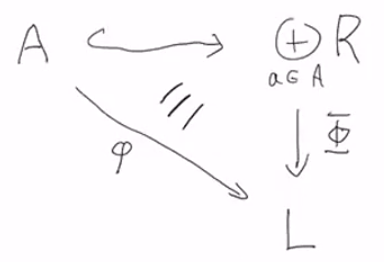

# Modules

$$
\newcommand{\ds}{\displaystyle}
\newcommand{\curlies}[1]{\left\lbrace #1 \right\rbrace}
\newcommand{\abs}[1]{\left\lvert #1 \right\rvert}
\newcommand{\angles}[1]{\left\langle #1 \right\rangle}
\newcommand{\inv}[1]{#1^{-1}}
\newcommand{\divides}{ {\large\mid} }
\newcommand{\ndivides}{ {\large\not\mid} }
\newcommand{\th}{^{\text{th}}}

\DeclareMathOperator{\Hom}{Hom}

\newcommand{\Sp}{\mathbb S}
\newcommand{\F}{\mathbb F}
$$

## Modules

Let $R$ be a ring (we don't have any conditions on $R$, it doesn't need to be a very nice ring). A **left module $M$ over $R$** (an $R$-module) is an abelian group $M$ with a mutliplication operation with $R$:

$$
\begin{align*}
R \times M &\to M \\
(r, m) &\mapsto r \cdot m = rm
\end{align*}
$$

that satisfies the properties

- if $r, s \in R$ and $m \in M$, then $(r + s) m = rm + sm$ (distributive)
- if $r \in R$ and $m, n \in M$, then $r(m + n) = rm + rn$ (distributive)
- if $r, s \in R$ and $m \in M$ then $(rs)m = r(sm)$ (associative)
- if $1 \in R$ and $m \in M$ then $1m = m$ (multiplicative identity)

We can similarly define a right module or a two-sided module, however we generally work with left modules.

If $R$ is a field, then an $R$-module is a vector space over $R$.

### $\Z$-modules

If $M$ is any abelian group, $M$ is a $\Z$-module if we define multiplication in the obvious way.

Let $n \in \Z$ and $m \in M$. If $n > 0$, then

$$
n \cdot m = \underbrace{m + ... + m}_{n \text{ times}}
$$

If $n = 0$, then

$$
n \cdot m = 0
$$

If $n < 0$, then

$$
n \cdot m = \underbrace{(-m) + ... + (-m)}_{n \text{ times}}
$$

Conversely, any $\Z$-module is simply an abelian group, with some nicer notation. There is no extra structure gained through being a module.

### Modules over polynomial rings of fields

Let $R = F[x]$ for a field $F$. If $M$ is an $R$-module, then it is a vector space over $F$, but elements can also be multiplied by $x$. Multiplication by $x$ turns out to be a linear transformation. Thus, we can think of $M$ as a vector space equipped with a linear transformation.

Conversely, if $M$ is a vector space over $F$ and $T: M \to M$ is a linear transformation, then we can think of $M$ as a module over $F[x]$ where multiplication by $x$ is determined by applying $T$, i.e. we define

$$
(a_n x^n + ... + a_1 x + a_0) \cdot m = a_nT^n m + ... + a_1 T m + a_0 m
$$

Thus, we have a correspondence between modules over $F[x]$ and vector spaces over $F$ with a linear transformation. This will be important later for investigating the Jordan canonical form.

### Submodules

If $M$ is an $R$-module and $N \leq M$ ($N$ is a subgroup of $M$), then $N$ is a  **submodule** of $M$ if for all $r \in R$ and $n \in N$, $rn \in N$.

Equivalently, $N$ is a submodule if for all $n_1, n_2 \in N$ and $r \in R$, we have $n_1 + rn_2 \in N$.

### Rings as modules over themselves

If $R$ is a ring, then it itself is an $R$-module. The submodules of this module are the left ideals of $R$.

### Free modules

For any ring $R$, we can make $R^n$, the **free $R$-module of rank $n$**:

$$
R^n = \curlies{(r_1, ..., r_n) : r_i \in R}
$$

Where multiplication is defined componentwise, i.e.

$$
s \cdot (r_1, ..., r_n) = (s r_1, ..., s r_n)
$$

This contains submodules

$$
(R^n)_i = \curlies{(0, ..., 0, r_i, 0, ..., 0) : r \in R}
$$

### Quotient modules

Let $R$ be a ring, let $M$ be an $R$-module, and let $N \leq M$ be a submodule. Then $M/N$ is an abelian quotient group whose elements are cosets that look like $m + N$. Since $N$ is a submodule, the obvious definition of multiplication works:

$$
r(m + N) = rm + N
$$

Thus $N$ is a **quotient module** of $M$.

### Module homomorphisms

If $M, N$ are $R$-modules, $\phi$ is an **$R$-module homomorphism** if it is a group homomorphism which also respects multiplication by elements of $r$. i.e. if $x, y \in M$ and $r \in R$, then

$$
\begin{align*}
\phi(x+y) &= \phi(x) + \phi(y) \\
\phi(rx) &= r\phi(x)
\end{align*}
$$

We denote the set of all $R$-module homomorphisms from $M \to N$ as $\Hom_R(M, N)$.

We can define related notions in an unsurprising way:

The **kernel** of $\phi$ is defined as usual, as $\inv \phi \curlies 0$. This is a submodule of $M$.

An **$R$-module isomorphism** is a homomorphism of $R$-modules that is bijective.

$R$-modules $M$ and $N$ are **isomorphic** if there exists an $R$-module isomorphism between them. We write $M \cong_R N$ to denote that this is an isomorphism of $R$-modules, rather than simply an isomorphism of the underlying abelian groups.

#### Structure of $\text{Hom}_R(M, N)$

Note that homomorphisms $\phi, \psi \in \Hom_R(M, N)$ can be added and subtracted, and the zero homomorphism exists, so $\Hom_R(M, N)$ is an abelian group. If $r \in R$, then $r\phi$ is also a homomorphism, so $\Hom_R(M, N)$ is an $R$-module.

Also note that if $\phi, \psi \in \Hom_R(M, M)$, then $\phi \circ \psi$ and $\psi \circ \phi$ are also homomorphisms. If we treat function composition as "multiplication", then $\Hom_R(M, M)$ becomes a ring. We call this the **endomorphism ring** of $M$, and denote it $\text{End}(M)$.

#### Modules and homomorphisms between rings

Suppose $R, S$ are rings with identity and $\psi : R \to S$ is a ring homomorphism. Then if $M$ is an $S$-module, we can turn it into an $R$-module by defining multiplication as

$$
r \cdot m = \psi(r) \cdot m
$$

for $r \in R$ and $m \in M$

#### Isomorphism theorems for modules

**First isomorphism theorem:**

If $\phi : M \to N$ is an $R$-module homomorphism, then

$$
\phi(M) \cong_R M / \ker(\phi)
$$

**Second isomorphism theorem:**

If $A, B$ are submodules of an $R$-module $M$, then

$$
(A + B) / B \cong_R A / (A \cap B)
$$

**Third isomorphism theorem:**

If $C \subseteq_R B \subseteq_R A$, i.e. if $C$ is a submodule of $B$ and $B$ is a submodule of $A$, then

$$
A/B \cong_R (A/C) / (B/C)
$$

**Fourth (lattice) isomorphism theorem:**

If $M$ is an $R$-module and $N \subseteq_R M$, then the lattice of submodules of $M$ which contain $N$ (i.e. $N \subseteq_R A \subseteq_R M$) is isomorphic to the lattice of submodules of $M/N$.

### Generators

If $M \subseteq_R N$, a subset $A \subseteq M$ is a **set of generators** of $M$ if $M$ is the smallest submodule of $M$ containing $A$. Alternatively, $A$ generates $M$ if $M$ is the intersection of all submodules containing $A$:

$$
M = \bigcap_{A \subseteq S \subseteq_R N} S
$$

### Direct sums

If $M, N$ are $R$-modules, then their **direct sum** is

$$
M \oplus N = \curlies{(m, n) : m \in M, n \in N}
$$

This is an $R$-module with componentwise multiplication by $R$.

This corresponds to our notions of direct products of groups and of direct sums of vector spaces.

We can extend this definition to finite direct sums $M_1 \oplus ... \oplus M_n$ in the obvious way. Note that the free module $R^n$ is the direct sum $R \oplus ... \oplus R$.

We can also define infinite direct sums:

If for each $i \in I$ we have an $R$-module $M_i$, we can define the direct sum as

$$
\underset{i \in I}{\oplus} M_i = \curlies{(m_i) : m_i = 0 \text{ except for only finitely many $i$'s}}
$$

This works for index sets $I$ of any cardinality.

### Universal property of the free module on $A$

Let $A$ be any set without any structure, and let $R$ be a ring with identity. The **free module on $A$** is the direct sum of $\abs{A}$ copies of $R$, each copy indexed by an element of $A$.

$$
\underset{a \in A}{\oplus} R = \curlies{(r_a) : r_a = 0 \text{ except for only finitely many $a$'s}}
$$

Then we can think of $A$ as a subset of $\underset{a \in A}{\oplus} R$ by making a correspondence between $t \in A$ and the element

$$
i(a) = (x_a)_{a \in A} \text{ where } x_{t} = 1 \text{ and } x_a = 0 \text{ for all } a \neq t
$$

We can think of the map $i : A \to \underset{a \in A}{\oplus} R$ which makes this correspondence as an inclusion map.

Suppose $L$ is an $R$-module, then we have the following *universal property*:

If $\phi : A \to L$ is any map, then there is a unique homomorphism $\Phi : \underset{a \in A}{\oplus} R \to L$ so that the following diagram commutes:

i.e. we have the equality of maps $\phi(a) = \Phi(i(a))$.

We know the value of $\Phi$ for every $i(a)$, i.e. every element which has a $1$ in one coordinate and $0$s everywhere else. However, these elements generate all of $\underset{a \in A}{\oplus} R$, so this determines the value of $\Phi$ for every element. This means $\Phi$ is unique. It is easy to show that $\Phi$ is a homomorphism.

