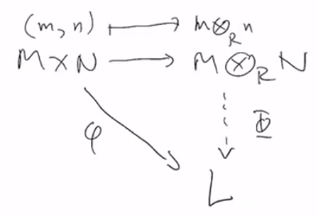

# Tensor Products

$$
\newcommand{\ds}{\displaystyle}
\newcommand{\curlies}[1]{\left\lbrace #1 \right\rbrace}
\newcommand{\abs}[1]{\left\lvert #1 \right\rvert}
\newcommand{\angles}[1]{\left\langle #1 \right\rangle}
\newcommand{\inv}[1]{#1^{-1}}
\newcommand{\divides}{ {\large\mid} }
\newcommand{\ndivides}{ {\large\not\mid} }
\newcommand{\th}{^{\text{th}}}

\newcommand{\Sp}{\mathbb S}
\newcommand{\F}{\mathbb F}
$$

## Tensor Products

### First construction

We start our investigation of tensor products with a special case, motivated by the question: Suppose $M$ is an $R$-module and $R$ is a subring of $S$. Can we extend $M$ to be an $S$-module?

In general, the answer is no. For example, suppose $M$ is a finite abelian group, then it is a module over $\Z$. Then since it is finite, we cannot extend it to be a module over $\Q$, as every vector space over $\Q$ is infinite.

Instead, we could ask "To what extent can we extend our $R$-module?"

Consider the free module made from the set $S \times M$, i.e. all formal sums of elements $(s, m)$. We want to think of pairs of $(s, m)$ as multiplying $s \cdot m$, and we want these pairs to end up satisfying the module axioms. To do this, we will take a quotient on this free module.

Let $N$ be the submodule containing all elements of the form:

- $(s_1 + s_2, m) - (s_1, m) - (s_2, m)$
- $(s, m_1 + m_2) - (s, m_1) - (s, m_2)$
- $(sr, m) - (s, rm)$

Then if we take the quotient $(S \times M) / N$, we get an object where each type of element listed above represents $0$, which imposes distributivity and associativity.

We call $(S \times M) / N$ the **tensor product of $S$ and $M$ over $R$** and denote it by $S \otimes_R M$ (or just $S \otimes M$ if the underlying ring is clear). If $(s, m) \in S \times M$, we denote the coset they belong to in $S \otimes M$ by $s \otimes m$, because we are thinking of each coset as a "product". Because of the equivalences we defined with our quotient, we have:

- $(s_1 + s_2) \otimes m = s_1 \otimes m + s_2 \otimes m$
- $s \otimes (m_1 + m_2) = s \otimes m_1 + s \otimes m_2$
- $sr \otimes m = s \otimes rm$

Elements of the form $s \otimes m$ are called **simple tensors** and elements of $S \otimes M$ in general are called **tensors**.

### Example: $\Q \otimes_\Z \Z/p\Z$

Suppose $\overline{m} \in \Z/p\Z$, then

$$
\begin{align*}
1 \otimes_\Z \overline m &= \frac{1}{p} \cdot p \otimes_\Z \overline m \\
&= \frac{1}{p} \otimes_\Z p \cdot \overline m \tag{$sr \otimes m = s \otimes rm$} \\
&= \frac{1}{p} \otimes_\Z 0 \tag{$\overline m \in \Z/p\Z$} \\
&= \frac{1}{p} \otimes_\Z 0 \cdot 0 \\
&= \frac{1}{p} \cdot 0 \otimes_\Z 0 \\
&= 0 \otimes_\Z 0
\end{align*}
$$

so $\Q \otimes_\Z \Z/p\Z = \curlies 0$.

### Universal property of tensor products

Let $M$ be an $R$-module, let $S$ be a ring so that $R \subseteq S$, and consider the $S$-module $S \otimes_R M$. Consider the inclusion function

$$
\begin{align*}
\iota : M &\to S \otimes_R M \\
m &\mapsto 1 \otimes m
\end{align*}
$$

Suppose $L$ is a (left) $S$-module, then $L$ is also an $R$-module.

Let $\phi : M \to L$ be an $R$-module homomorphism. Then there is a unique $S$-module homomorphism $\Phi : S \otimes_R M \to L$ so that $\Phi \circ \iota = \phi$.

### General tensor products

If $M$ is a right $R$-module and $N$ is a left $R$-module, then we can define their **tensor product** $M \otimes_R N$ similarly to how we defined $S \otimes M$ above for a ring $S$ containing $R$ (using a quotient of the free module).

It has a slightly different universal property:

If $L$ is a ring and $\phi : M \times N \to L$ is a map so that

$$
\begin{align*}
\phi(m + m'r, n) = \phi(m, n) + r\phi(m', n) \\
\phi(m, n + rn') = \phi(m, n) + r\phi(m, n')
\end{align*}
$$

then we call $\phi$ a **balanced map** or an **$R$-bilinear map**.

The **universal property of tensor products** is that if $phi : M \times N \to L$ is $R$-bilinear, then there exists a unique map $\Phi : M \otimes_R N$ so that $\phi = \Phi \circ \iota$, where $\iota : M \times N \to M \otimes_R N$ is the inclusion map. i.e., there exists a unique $\Phi$ so that the following diagram commutes:

Note that the previous universal property is a special case of this one.

#### Example: Coprime cyclic groups

Suppose $R = \Z$, $M = \Z/2\Z$, and $N = \Z/3\Z$. If $a \in \Z/2\Z$ and $b \in \Z/3\Z$, then

$$
\begin{align*}
2 \cdot (a \otimes b) &= 2a \otimes b \\
&= 0 \otimes b \\
&= 0 \otimes 0 \\
3 \cdot (a \otimes b) &= a \otimes 3b \\
&= a \otimes 0 \\
&= 0 \otimes 0 \\
a \otimes b &= (3 - 2) \cdot (a \otimes b) \\
&= 3 \cdot (a \otimes b) - 2 \cdot (a \otimes b) \\
&= 0 \otimes 0 - 0 \otimes 0 \\
&= 0 \otimes 0
\end{align*}
$$

so $\Z/2\Z \otimes_Z \Z/3\Z = \curlies 0$. The universal property tells us that as a result, there cannot be a nontrivial bilinear map from $\Z/2\Z \times \Z/3\Z$ to any group.

### Associativity of tensor products

Considering modules $L, M, N$ over $R$, the tensor product is associative, so

$$
(L \otimes_R M) \otimes_R N \cong L \otimes_R (M \otimes_R N)
$$

Since taking tensor products is associative, the universal property of tensor products informs the existence of multilinear maps as well.